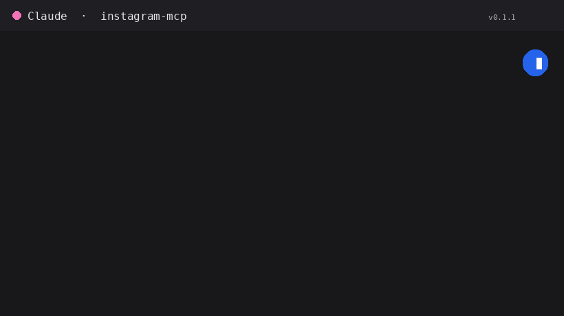

# instagram-mcp — multi-account Instagram + Facebook Pages for Claude



[](https://opensource.org/licenses/MIT)

Manage many Instagram **Business/Creator** accounts **and** their **Facebook Pages**
from Claude — publish posts, reels, stories and carousels, handle comments, send DMs,
and pull insights. Built on the [Model Context Protocol](https://modelcontextprotocol.io)
(FastMCP + httpx).

A multi-account fork of [AleemHaider/instagram-mcp](https://github.com/AleemHaider/instagram-mcp)
that adds: an `account` selector on every tool, 8 Facebook Page tools, a `list_accounts`
tool, a **plugin with guided onboarding**, and **automatic Graph API version maintenance**.

## Install (the easy way)

In Claude → **Settings → Directory → Plugins → Add marketplace**, paste the repository:

```
https://github.com/claudiachez/instagram-mcp
```

Click **Sync**, then install the **instagram-social** plugin.

Then just ask Claude:

> Connect my Instagram account

The guided setup (`/instagram-social:connect-meta-account`) walks you through generating a
key and saving the account. Repeat for each account. A welcome nudge reminds you until at
least one account is connected.

> **The plugin runs via `uv`** (a small, fast Python runner). Install it once with whatever
> you trust — `brew install uv` (Homebrew) or `pip3 install uv` (from PyPI); the
> [official installer](https://docs.astral.sh/uv/) is from Astral, the makers of the Ruff
> linter. **Don't want to install anything?** Use the
> [Claude Desktop extension (`.mcpb`)](#alternative-claude-desktop-extension-mcpb) instead —
> it bundles everything and needs no `uv`.

## Everyday use

Name the account by its nickname (the alias you chose during setup):

- *"Post this photo to `brand_a` with caption 'Weekend vibes ☀️'"*
- *"Reply 'Thanks so much!' to the newest comments on `brand_b`'s latest post"*
- *"What was `brand_a`'s reach and follower change this week?"*
- *"Show me all the accounts I can manage"*

## What it can do

Every tool takes an `account` (the alias) as its first argument. Omit it when only one
account is configured.

### Accounts

| Tool | What it does |
|---|---|
| `list_accounts` | Aliases + IG user IDs + FB Page IDs + live usernames (never tokens) |

### Instagram — profile & media

| Tool | What it does |
|---|---|
| `get_my_profile` | Profile info: bio, followers, media count, etc. |
| `list_my_media` | One page of recent posts |
| `list_all_media` | Auto-paginate through all media |
| `get_media` | Fetch a single media item |
| `list_tagged_media` | Posts the account is tagged in |
| `list_stories` | Currently-live stories (24h window) |

### Instagram — hashtags

| Tool | What it does |
|---|---|
| `search_hashtag` | Resolve a `#tag` to its ID |
| `hashtag_top_media` | Top-ranked posts for a hashtag |
| `hashtag_recent_media` | Recent posts for a hashtag (24h window) |

### Instagram — publishing

| Tool | What it does |
|---|---|
| `publish_image` | Single image post from a public URL |
| `publish_reel` | Reel (waits for container processing) |
| `publish_story` | Image or video story |
| `publish_carousel` | 2–10 item carousel |
| `get_publish_limit` | Show 24h publish quota usage |

### Instagram — comments

| Tool | What it does |
|---|---|
| `list_comments` | Top-level comments + nested replies |
| `get_comment_replies` | Replies under a specific comment |
| `reply_to_comment` | Post a reply |
| `hide_comment` | Hide / unhide |
| `delete_comment` | Delete a comment you own |

### Instagram — direct messages

| Tool | What it does |
|---|---|
| `list_conversations` | DM conversations |
| `get_conversation` | Messages in a conversation |
| `send_dm` | Send a DM (optionally with a `message_tag`) |

> DM tools also need the `instagram_manage_messages` scope on the token — add it during
> the token step if you plan to use them.

### Instagram — insights

| Tool | What it does |
|---|---|
| `get_account_insights` | Account-level metrics with optional `metric_type` |
| `get_media_insights` | Per-media insights |

### Facebook Pages

| Tool | What it does |
|---|---|
| `fb_publish_post` | Publish a text/link status or a photo |
| `fb_publish_video` | Publish a video from a public URL |
| `fb_list_posts` | Recent Page posts |
| `fb_list_comments` | Comments on a Page post |
| `fb_reply_to_comment` | Reply to a Page comment |
| `fb_hide_comment` | Hide / unhide a Page comment |
| `fb_delete_comment` | Delete a Page comment |
| `fb_page_insights` | Page-level insights |

## Accounts & configuration

Accounts are one JSON object mapping a **nickname** → account. The server reads it, in
priority order, from:

1. the `IG_ACCOUNTS` environment variable, or
2. a file at `~/.instagram-mcp/accounts.json` (what the guided setup writes; override the
   path with `IG_ACCOUNTS_FILE`), or
3. legacy single-account mode via `IG_USER_ID` + `IG_ACCESS_TOKEN`.

```json
{
  "brand_a": {"user_id": "17841...", "token": "EAA...", "fb_page_id": "10x..."},
  "brand_b": {"user_id": "17841...", "token": "EAA..."}
}
```

- `fb_page_id` is optional — required only for the `fb_*` Facebook Page tools.
- Per-account `graph_version` / `host` override the global `IG_GRAPH_VERSION` /
  `IG_GRAPH_HOST` (defaults: `v21.0`, `graph.facebook.com`).

### Generating keys (the get-token helper)

```bash
instagram-mcp-get-token
```

Asks for your App ID + App Secret + a short-lived token, exchanges it for a long-lived
key, lists your linked accounts, and prints a ready-to-paste line (including the Page ID)
for the accounts JSON.

### Getting a short-lived token

In the [Graph API Explorer](https://developers.facebook.com/tools/explorer): select your
app, choose **User Token**, add these scopes, click **Generate Access Token**, log in, and
choose the Pages you manage:

`instagram_basic`, `instagram_content_publish`, `instagram_manage_comments`,
`instagram_manage_insights`, `pages_show_list`, `pages_read_engagement`,
`business_management` (add `instagram_manage_messages` for DMs).

> While the Meta app is in **Development mode**, only people added to the app
> (admins/developers/testers) can authenticate — which is exactly right for internal/team
> use. Public distribution would require Meta **App Review**.

## Automatic Graph API version maintenance

A weekly GitHub Action probes Meta for new Graph API versions, smoke-tests them against
your live accounts, and opens a **pre-tested bump PR** (or an urgent issue if the current
version breaks). Merging the PR auto-builds a fresh release. Details in
[README-FORK.md](README-FORK.md).

## For teammates

They install the plugin the same way, then either run the guided setup for their own
accounts or you privately share your accounts JSON for them to paste. **Never share tokens
over open chat or email.** Creating keys for a brand-new account requires being added to
the Meta app first (an admin does this once).

## Alternative: Claude Desktop extension (`.mcpb`)

Prefer not to install `uv`? Every push auto-builds a self-contained `instagram-mcp.mcpb`
attached to a GitHub Release. Download it and drag into **Claude Desktop → Settings →
Extensions**, then paste your accounts JSON into the config panel (stored as sensitive).

## Notes & gotchas

- **Publishing needs public HTTPS URLs** — Meta fetches media server-side.
- **Publish quota** is ~100 posts per rolling 24h on most Business accounts.
- **`send_dm` is response-only by default** (24h user-initiated window); a `message_tag`
  like `HUMAN_AGENT` escapes it but needs Meta approval.
- **Some insight metrics need `metric_type='total_value'`**: `views`, `accounts_engaged`,
  `total_interactions`, `profile_views`, `likes`, `comments`, `shares`, `saves`.
- **Errors return a structured dict** (`error: true` with `status`, `message`, `code`,
  `subcode`, `fbtrace_id`) — the Graph API error, not a Python traceback.

## Development

```bash
git clone https://github.com/claudiachez/instagram-mcp
cd instagram-mcp
python -m venv .venv && source .venv/bin/activate
pip install -e ".[dev]"
pytest
```

## Credits

- Original **instagram-mcp** by **Syed Aleem** —
  [AleemHaider/instagram-mcp](https://github.com/AleemHaider/instagram-mcp).
- Multi-account support, the Facebook Page tools, `list_accounts`, the plugin + guided
  onboarding, and the Graph API version automation by **Claudia Chez**
  ([@claudiachez](https://github.com/claudiachez)).

## License

MIT — see [LICENSE](LICENSE).
